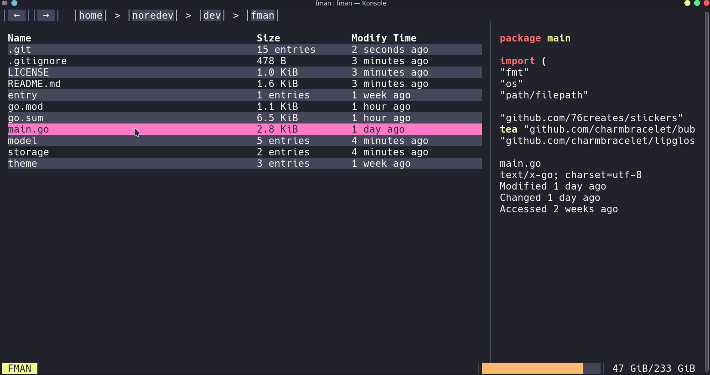

# FMAN

**FMAN** is an easy to use TUI **F**ile **Man**ager.

## Features

- Mouse Support
- Clean UI
- File Preview
- Syntax Highlighting
- Themes

## Installation

`go install github.com/nore-dev/fman@latest`

## Keybindings

|      Key      |                Description                |
|:-------------:|:-----------------------------------------:|
|  `q, Ctrl+C`  |           Exit from application           |
|  `a, h, left` |          Move to parent directory         |
| `d, l, right` |         Move to selected directory        |
|  `s, j, down` |              Move cursor down             |
|   `w, k, up`  |               Move cursor up              |
|    `enter`    |   Open file/folder with default program   |
|       `c`     | Copy selected entry path to the clipboard |

## Built With
Without these projects this project would not have existed at all.
- [Bubbletea]()
- [Lipgloss]()
- [Bubblezone]()
- [Chroma]()

## CONTRIBUTING

Contributions are what make the open source community such an amazing place to learn, inspire, and create. Any contributions you make are **greatly appreciated**.

If you have a suggestion that would make this better, please fork the repo and create a pull request. You can also simply open an issue with the tag "enhancement".
Don't forget to give the project a star! Thanks again!

1. Fork the Project
2. Create your Feature Branch (`git checkout -b feature/AmazingFeature`)
3. Commit your Changes (`git commit -m 'Add some AmazingFeature'`)
4. Push to the Branch (`git push origin feature/AmazingFeature`)
5. Open a Pull Request

## LICENSE
Distributed under the MIT License. See `LICENSE` for more information.

## Acknowledgments

Inspired by [knipferrc/fm](https://github.com/knipferrc/fm)
