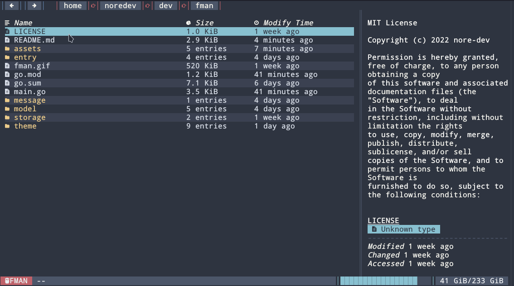

# FMAN
  [](https://actions-badge.atrox.dev/nore-dev/fman/goto?ref=main) [](https://makeapullrequest.com) 

> **Awesome TUI File Manager**

<div align="center">

[Features](#rocket-features) • [Installation](#zap-installation) • [Built With](#heart-built-with) • [Themes](#lipstick-themes) • [License](#pagefacingup-license)

</div>



## :rocket: Features

- Mouse Support
- Clean UI
- File Preview
- Syntax Highlighting
- Themes
- Copy Path to Clipboard
> More on the way!!

> NOTE: If you want to edit your files in the terminal you must set the `EDITOR` environment variable to your favorite editor. Example: ```vim, nvim, emacs...```

## :zap: Installation
### Pre-built Binaries
You can install pre-built binaries on the [releases](https://github.com/nore-dev/fman/releases) page
### GO

```
$ go install github.com/nore-dev/fman@latest
```

## :keyboard: Keybindings

|      Key      |                Description                |
| :-----------: | :---------------------------------------: |
|  `q, Ctrl+C`  |           Exit from application           |
| `a, h, left`  |         Move to parent directory          |
| `d, l, right` |        Move to selected directory         |
| `s, j, down`  |             Move cursor down              |
|  `w, k, up`   |              Move cursor up               |
|    `enter`    |   Open file/folder with default program   |
|      `c`      | Copy selected entry path to the clipboard |
|   `shift+g`   |        Move to the end of the list        |
|     `gg`      |     Move to the beginning of the list     |
|      `m`      |        Toggle showing hidden Files        |
|    `~, .`     |        Move to the home directory         |

## :computer: CLI options

|        Key        |   Type   |        Values         | Default value |
| :---------------: | :------: | :-------------------: | :-----------: |
|     `--theme`     | `string` | `dracula,brogrammer`  |   `dracula`   |
| `--icons` | `string` | `nerdfont,emoji,none` |  `nerdfont`   |

## :heart: Built With

Without these projects this project would not have existed at all.

- [Bubbletea](https://github.com/charmbracelet/bubbletea/)
- [Lipgloss](https://github.com/charmbracelet/lipgloss)
- [Bubblezone](https://github.com/lrstanley/bubblezone)
- [stickers](https://github.com/76creates/stickers)
- [Chroma](https://github.com/alecthomas/chroma)
- [go-arg](https://github.com/alexflint/go-arg)

## :lipstick: Themes
| | |
|:-------------------------:|:-------------------------:|
|  dracula  |  catppuccin |
|  nord |   gruvbox ||
|  brogrammer |  everblush|
                          

## :busts_in_silhouette: CONTRIBUTING

Contributions are what make the open source community such an amazing place to learn, inspire, and create. Any contributions you make are **greatly appreciated**.

If you have a suggestion that would make this better, please fork the repo and create a pull request. You can also simply open an issue with the tag "enhancement".
Don't forget to give the project a star! Thanks again!

1. Fork the Project
2. Create your Feature Branch (`git checkout -b feature/AmazingFeature`)
3. Commit your Changes (`git commit -m 'Add some AmazingFeature'`)
4. Push to the Branch (`git push origin feature/AmazingFeature`)
5. Open a Pull Request

## :page_facing_up: LICENSE

Distributed under the MIT License. See `LICENSE` for more information.

## :question: Acknowledgments

Inspired by [knipferrc/fm](https://github.com/knipferrc/fm)
